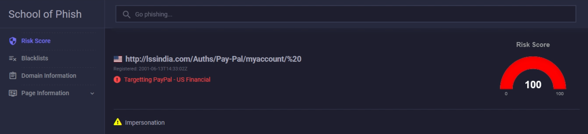
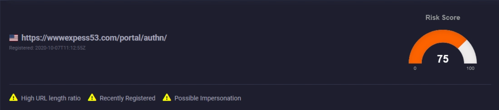

# School-of-Phish

A web dashboard designed to enrich / analyze potential phishing links.

 

   

Simply submit a URL to be presented with a risk score, along with suspicious indicators that the site could be malicious.

To determine the "risk score" for a site, various heuristics are used such as: entropy, presence of suspicious keywords, domain registration date, and string closeness to brand names (impersonation). It also cross-references the URL in several blacklists, and allows the analyst to view a page screenshot or the DOM without actually having to navigate to the page themselves.

 

